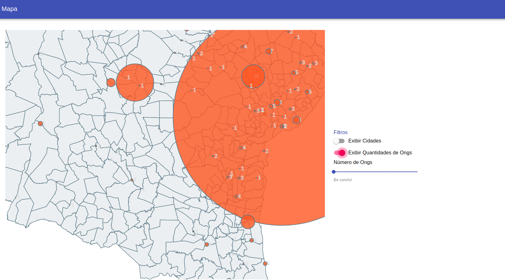

# Projeto de mestrado
## Mapa do Terceiro Setor
### Um framework, colaborativo e multiplataforma para visualização e cruzamento de dados

## Objetivo
### Correlacionar atraves de uma ferramenta open-source dados socio demograficos relacionados ao terceiro setor no estado da bahia.

### DEMO
https://shrouded-gorge-63100.herokuapp.com/

### TECNOLOGIAS
1. ReactJS - framework javascript usado para atualização interativa do mapa
1. MaterialUI - framework css para exibição do layout, botões, cards
1. SimpleMap - componente simples para exibição de mapas e interação sem necessidade de api para mapas externos como googlemaps, openstreetview.. etc
1. TopoJson - padrão usado para armazenar os dados georeferenciados em json file

### RUN
1. npm install
1. npm start

### DADOS
1. https://mapaosc.ipea.gov.br/resultado-consulta.html
1. http://atlasbrasil.org.br/2013/pt/mapa/

